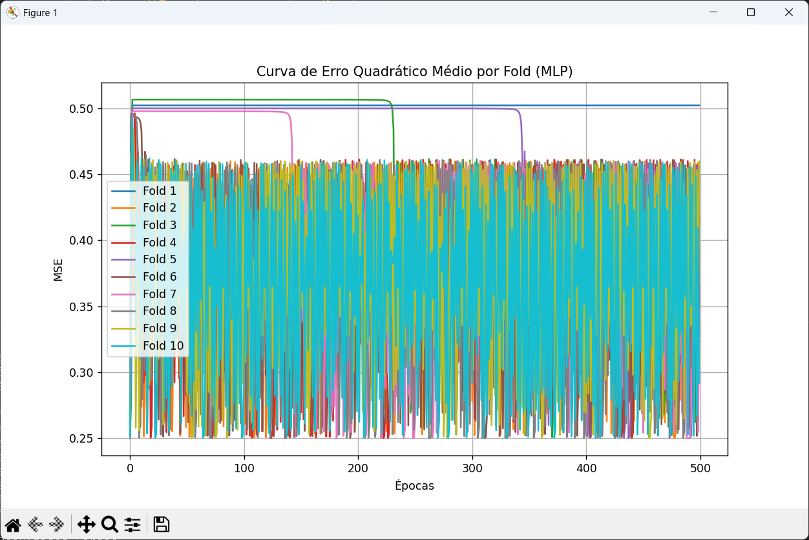
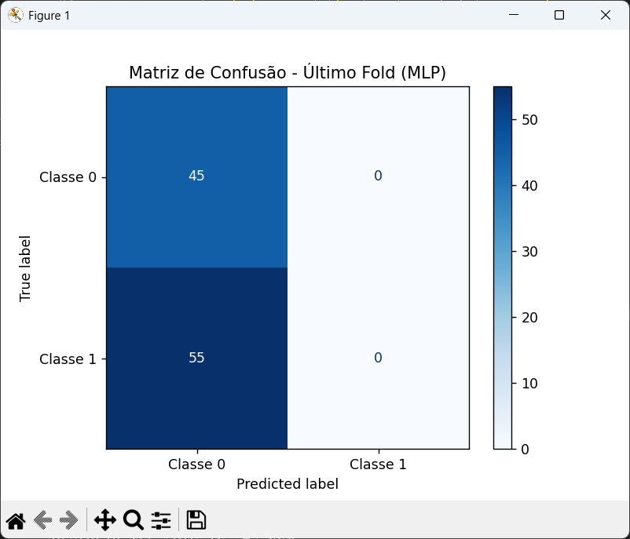

# Projeto de Análise e Classificação com MLP e Perceptron

Este projeto contém dois scripts principais:

- `dataset.py`: gera um dataset fictício para análise de crédito.
- `analise.py`: implementa e avalia uma rede neural MLP e um perceptron simples usando um dataset fictício gerado com `make_moons`.

---

## 1. dataset.py

### Objetivo
Gerar um dataset sintético com variáveis relacionadas a um cenário de análise de crédito, incluindo idade, salário, tempo de emprego, dívida, escolaridade e uma variável alvo de aprovação (0 ou 1) baseada em regras fictícias.

### Como funciona
- Gera 500 amostras aleatórias com os dados descritos.
- Aplica uma função para determinar aprovação segundo um score baseado nas variáveis.
- Salva o dataset em CSV (`credito_dataset.csv`).
- Exibe as primeiras linhas no console.

### Uso
```bash
python dataset.py
```

## 2. analise.py
### Objetivo
Implementar uma Multi-Layer Perceptron (MLP) com múltiplas camadas ocultas para classificação binária, e comparar seu desempenho com um Perceptron simples (baseline) usando validação cruzada K-Fold.

### Como funciona
Usa o dataset sintético make_moons para classificação binária (não o dataset de crédito do dataset.py).

Normaliza os dados.

- Define uma MLP com 10 camadas ocultas, cada uma com 12 neurônios, usando função de ativação sigmoid.

- Treina a MLP por 500 épocas em cada fold de uma validação cruzada 10-fold.

- Também treina e avalia um Perceptron simples para comparação.

- Exibe as curvas de perda por fold, matriz de confusão do último fold e imprime um relatório resumido.

### Como funciona a MLP
Forward propagation com sigmoid.

Backpropagation implementado manualmente.

Atualização dos pesos com gradiente descendente simples.

Uso:
``` bash
python analise.py
```

### Saídas esperadas
Acurácia média e desvio padrão para MLP e Perceptron.

Gráfico da curva de erro quadrático médio (MSE) por época para cada fold.

Matriz de confusão do último fold para MLP.

Resumo das configurações e resultados no console.

<p float="left">
  
  
</p>

```bash
Relatório Resumido:
- Dataset: make_moons (1000 amostras, ruído=0.2)
- Arquitetura MLP: 10 camadas ocultas de 12 neurônios cada
- Função de ativação: sigmoid
- Otimização: backpropagation manual, LR=0.1, epochs=500
- Avaliação: 10-fold cross-validation
- Métricas: Acurácia e Erro Quadrático Médio (MSE)
- Resultados: MLP supera Perceptron simples em acurácia média (~49.20% vs 78.60%)
```

Requisitos
Python 3.7+

Bibliotecas Python:

numpy

pandas (para dataset.py)

matplotlib

scikit-learn

Você pode instalar as dependências com:

```bash
pip install numpy pandas matplotlib scikit-learn
```
### Estrutura do Projeto
```bash
bash
Copiar
Editar
/
├── dataset.py       # Script para gerar dataset fictício de crédito
├── analise.py       # Script para treinar e avaliar MLP e Perceptron
└── credito_dataset.csv (gerado pelo dataset.py)
```

### Observações
dataset.py gera um dataset diferente do dataset usado em analise.py.

O código da MLP em analise.py é uma implementação didática e manual, para fins educacionais.

Para adaptar analise.py para usar o dataset gerado em dataset.py, será necessário modificar o código para carregar e preparar esses dados.

